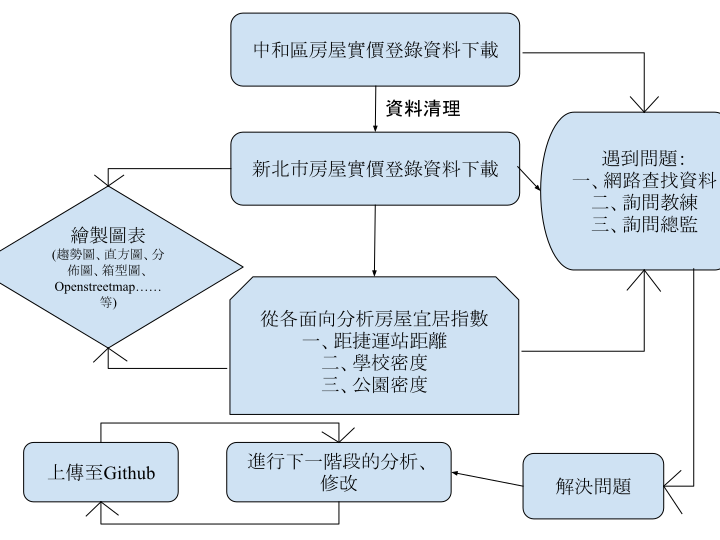

# 整理目前專案流程及架構，與目前的挑戰
一. 目前專案流程整理  
1. 下載並清理新北市中和區實價登錄資料（含缺失值處理）  
2. 初步進行 Exploratory Data Analysis（EDA）：價格分布、異常值、描述統計
3. 完成正則處理地址欄位，依道路/段數分群分析房價
4. 使用 Google Maps API 將地址轉為經緯度，並將經緯度欄位分別獨立出來
5. 準備與捷運站圖層進行空間重疊分析與距離計算
6. 準備與超市圖層進行空間重疊分析與距離計算
7. 準備與公園圖層進行空間重疊分析與距離計算

二. 專案架構概述
1. 資料來源與格式（CSV, SHP）
2. 主要套件工具（Pandas, Geopandas, Matplotlib, Seaborn, Google Maps API, Folium, dotenv）
3. 數據處理流程圖

4. 資料表結構與欄位規劃：目前延用csv原檔中的欄位規劃，唯新增以下欄位：
- 新增分類標籤欄：將地址欄位依路段分類，以便進行後續groupby的計算。
- 新增經度、緯度、及經緯度欄位：以便進行後續geopandas站點距離的計算。
